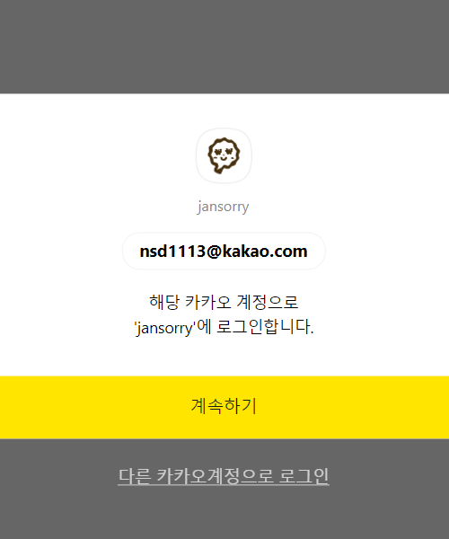
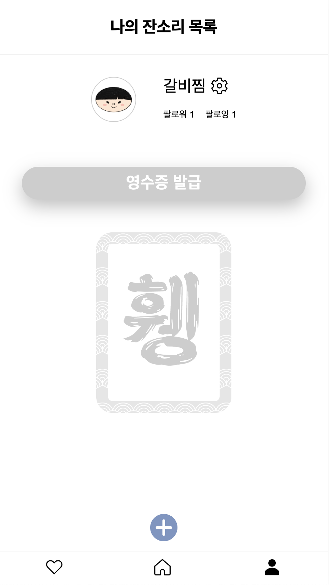
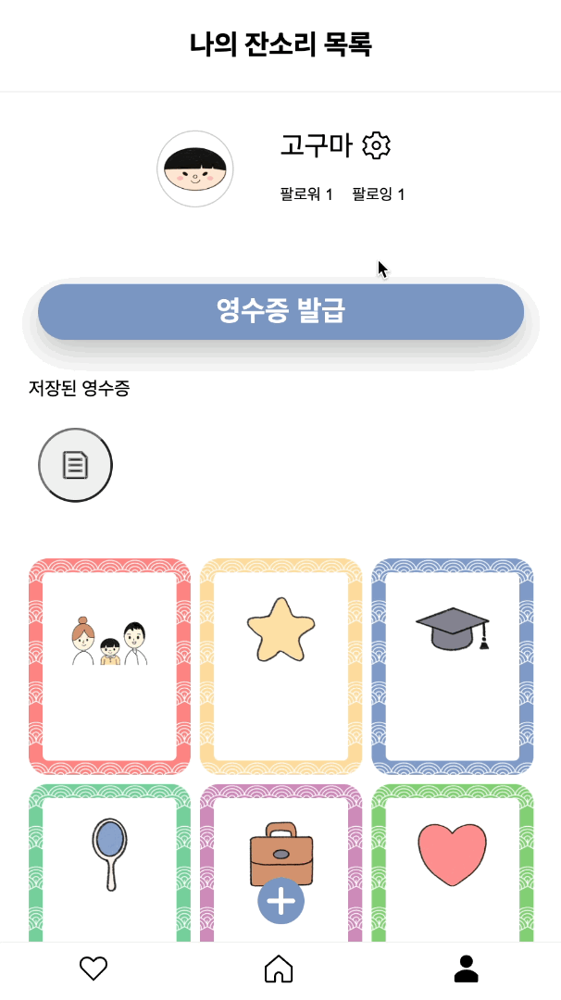
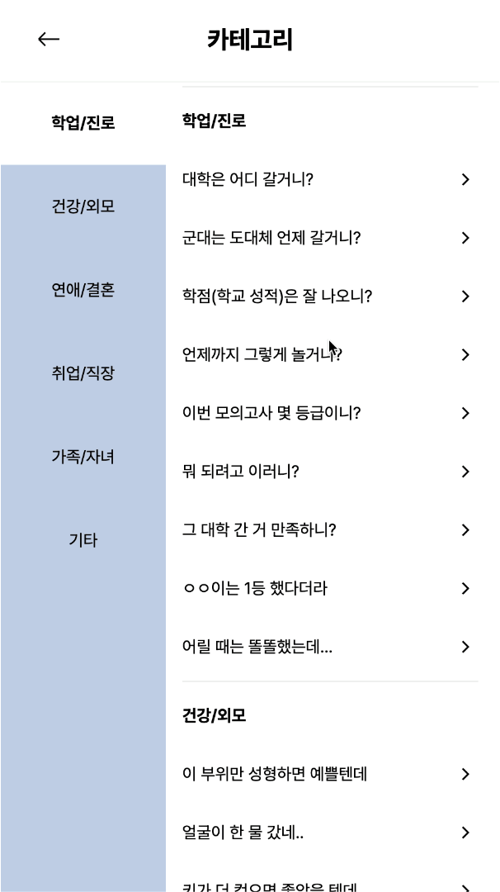
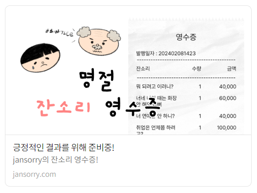
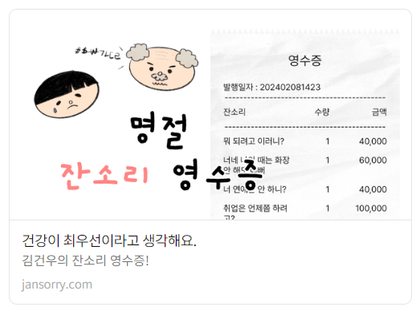

## 💬 프로젝트 소개

명절 잔소리 얼마나 들어보셨나요?  
나만의 잔소리 영수증을 만들고 비용을 청구하세요!  
내가 들은 잔소리에 반응을 추가하고 다른 사람들과 실시간으로 공유해보세요.

---

## 📚 목차

- [🎯 기획 배경](#plans)
- [🙇 팀원 소개](#members)
- [🔨 기술 스택](#skills)
- [🚀 실행 방법 및 배포 주소](#installation)
- [💡 주요 기능 및 역할](#features)

---

<a name="plans"></a>

## 🎯 기획 배경

<!-- TODO: notion - 기획서 - 기획 배경 참고, 변경 필요 -->

매년 명절마다 어른들의 잔소리로 인해 스트레스를 받는 사람들이 많습니다.  
이로 인해 가족 구성원 사이에 갈등이 생기며, 이러한 문제를 해결하기 위해 가족 간의 세대 갈등을 개선하는 플랫폼을 기획하게 되었습니다.  
잔소리를 공유하고 스트레스를 해소할 수 있는 공간을 제공하고, 영수증과 같은 유쾌한 방법으로 갈등을 회피하고 즐겁게 소통할 수 있는 방향으로 기획했습니다.

---

<a name="members"></a>

## 🙇 팀원 소개

|           [서범석](https://github.com/beomxtone)           |          [이담비](https://github.com/damdam6)          |          [류승광](https://github.com/sgryu23)           |          [김예림](https://github.com/ozllzlme)           |
| :--------------------------------------------------------: | :----------------------------------------------------: | :-----------------------------------------------------: | :------------------------------------------------------: |
|  |  |  |  |

---

<a name="skills"></a>

## 🔨 기술 스택

- Language: Typescript
- Core: Next 13.5.6
- Styling: Vanilla Extract
- State: Recoil

---

<a name="installation"></a>

## 🚀 실행 방법 및 배포 주소

```
// 패키지 라이브러리 설치
pnpm install

// 개발 환경 실행
pnpm dev

// 빌드 파일 생성
pnpm build
```

- 📱 front-domain : https://jansorry.com
- 🛠 back-server : https://jansorry.store
- 🔗 back-swagger : https://jansorry.store/swagger-ui/index.html

---

<a name="features"></a>

## 💡 주요 기능 및 역할

### 🖥️ 랜딩 페이지 - `서범석`

|                       첫 화면                        |
|:-------------------------------------------------:|
|  |

### 🔑 소셜 로그인 - `류승광`

|                          소셜 로그인                          |
|:--------------------------------------------------------:|
|  |

### 🍪 JWT, 쿠키 - `서범석`

<br />

### 👤 회원 가입 페이지 - `이담비`

|                      회원 가입                       |
|:------------------------------------------------:|
|  |

### 🏠 홈페이지 - `서범석`

|                      홈 화면 (카드 없음)                       |                    홈 화면 (카드 있음)                     |
|:-------------------------------------------------------:|:---------------------------------------------------:|
|  |  |

### 🙋‍♂️ 마이페이지 - `류승광`, `이담비`

|                       마이페이지(카드 없음)                        |                     마이페이지(카드 있음)                     |
|:---------------------------------------------------------:|:----------------------------------------------------:|
|  |  |

|                         팔로우 검색                         |
|:------------------------------------------------------:|
|  |

### 🕊️ 피드페이지 - `서범석`

|                    피드페이지                     |                        피드 태그 버튼                         |
|:--------------------------------------------:|:-------------------------------------------------------:|
|  |  |


### 🗂️ 카테고리 - `서범석`

|                        카테고리                        |                       내 카드 등록                        |
|:--------------------------------------------------:|:----------------------------------------------------:|
|  |  |

### ⚙️ 관리페이지 - `김예림`, `이담비`

|                         관리페이지                         |                         닉네임 수정                         |
|:-----------------------------------------------------:|:------------------------------------------------------:|
|  |  |

### 🃏 카드 - `이담비`

|                     카드 공통 컴포넌트                     |
|:--------------------------------------------------:|
|  |

### 🧾 영수증 생성 - `이담비`

|                          영수증 생성                          |
|:--------------------------------------------------------:|
|  |

### 🧾 영수증 공유 - `이담비`

|                         영수증 공유                          |
|:-------------------------------------------------------:|
|  |

### ⏳ 로딩, 에러페이지 - `김예림`

|                      로딩 페이지                       |                      에러 페이지                       |
|:-------------------------------------------------:|:-------------------------------------------------:|
|  |  |

### 🎈 오픈그래프 - `이담비`

|                        동적 오픈그래프                         |                    사용자에 따라 바뀌는 오픈그래프                    |
|:-------------------------------------------------------:|:-------------------------------------------------------:|
|  |  |

### 📂 폴더 구조 및 아키텍처 설계 - `서범석`

```
.
├── node_modules
├── public
└── src
    ├── app
    ├── components
    ├── constants
    ├── containers
    ├── hooks
    ├── services
    ├── states
    ├── styles
    ├── types
    └── utils
```
